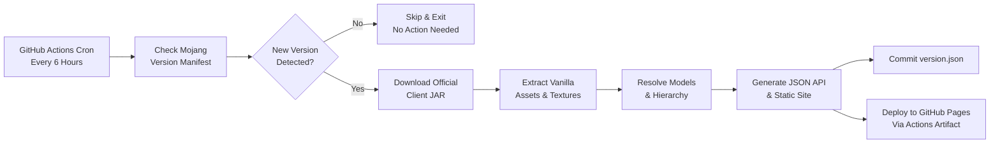

# Minecraft Auto-Updated Texture API

[](https://piston-meta.mojang.com/mc/game/version_manifest_v2.json)
[](https://project-crafting.github.io/minecraft-auto-updated-textures-api/api/manifest.json)
[](https://github.com/Project-crafting/minecraft-auto-updated-textures-api/actions)
[](LICENSE)

An automated, zero-maintenance API and static CDN that tracks the latest version of **Minecraft Java Edition**, downloads official vanilla assets directly from Mojang client JARs, resolves modern item model definitions to their corresponding textures, and publishes raw image URLs and structured JSON endpoints to **GitHub Pages**.

🌐 **Live Web Explorer & API:** [https://project-crafting.github.io/minecraft-auto-updated-textures-api/](https://project-crafting.github.io/minecraft-auto-updated-textures-api/)

---

## ⚡ Quick Endpoints

| Resource | URL Pattern | Example |
| :--- | :--- | :--- |
| **Direct Item Image (PNG)** | `/items/{item_name}.png` | [`/items/diamond.png`](https://project-crafting.github.io/minecraft-auto-updated-textures-api/items/diamond.png) |
| **Single Item JSON API** | `/api/item/{item_name}.json` | [`/api/item/diamond.json`](https://project-crafting.github.io/minecraft-auto-updated-textures-api/api/item/diamond.json) |
| **Vanilla Texture Path** | `/textures/{category}/{name}.png` | [`/textures/item/diamond.png`](https://project-crafting.github.io/minecraft-auto-updated-textures-api/textures/item/diamond.png) |
| **All Items Master Index** | `/api/items.json` | [`/api/items.json`](https://project-crafting.github.io/minecraft-auto-updated-textures-api/api/items.json) |
| **API Manifest** | `/api/manifest.json` | [`/api/manifest.json`](https://project-crafting.github.io/minecraft-auto-updated-textures-api/api/manifest.json) |
| **Privacy Policy** | `/privicy` / `/privacy` | [`/privicy`](https://project-crafting.github.io/minecraft-auto-updated-textures-api/privicy/) |

---

## 📦 JSON Response Format

### Single Item Endpoint (`/api/item/diamond.json`)
```json
{
  "id": "minecraft:diamond",
  "name": "diamond",
  "category": "item",
  "definition_file": "assets/minecraft/items/diamond.json",
  "model_references": [
    "minecraft:item/diamond",
    "minecraft:item/generated"
  ],
  "raw_url": "https://project-crafting.github.io/minecraft-auto-updated-textures-api/textures/item/diamond.png",
  "item_url": "https://project-crafting.github.io/minecraft-auto-updated-textures-api/items/diamond.png",
  "primary_texture": "textures/item/diamond.png",
  "textures": [
    {
      "resource": "minecraft:item/diamond",
      "role": "layer0",
      "path": "textures/item/diamond.png",
      "raw_url": "https://project-crafting.github.io/minecraft-auto-updated-textures-api/textures/item/diamond.png"
    }
  ]
}
```

### Multi-Faced Block Items (`/api/item/furnace.json`)
For block items with multiple faces (e.g. `furnace`, `dispenser`, `oak_log`), `raw_url` and `item_url` automatically point to the front/primary icon face, while the `textures` array contains all individual textures:
```json
{
  "id": "minecraft:furnace",
  "name": "furnace",
  "category": "block",
  "raw_url": "https://project-crafting.github.io/minecraft-auto-updated-textures-api/textures/block/furnace_front.png",
  "item_url": "https://project-crafting.github.io/minecraft-auto-updated-textures-api/items/furnace.png",
  "textures": [
    {
      "resource": "minecraft:block/furnace_front",
      "role": "front",
      "path": "textures/block/furnace_front.png",
      "raw_url": "https://.../textures/block/furnace_front.png"
    },
    {
      "resource": "minecraft:block/furnace_side",
      "role": "side",
      "path": "textures/block/furnace_side.png",
      "raw_url": "https://.../textures/block/furnace_side.png"
    },
    {
      "resource": "minecraft:block/furnace_top",
      "role": "top",
      "path": "textures/block/furnace_top.png",
      "raw_url": "https://.../textures/block/furnace_top.png"
    }
  ]
}
```

---

## 💻 Usage Examples

### 1. Direct HTML Image
Display any Minecraft item sprite crisp and pixel-perfect:
```html

```

### 2. JavaScript / TypeScript
```javascript
// Fetch single item metadata
async function getItemTexture(itemName) {
  const res = await fetch(`https://project-crafting.github.io/minecraft-auto-updated-textures-api/api/item/${itemName}.json`);
  const item = await res.json();
  console.log(`Primary texture for ${item.name}: ${item.raw_url}`);
  return item.raw_url;
}

getItemTexture('diamond');
getItemTexture('netherite_sword');
```

### 3. Python
```python
import requests

def get_item_texture(item_name: str) -> str:
    url = f"https://project-crafting.github.io/minecraft-auto-updated-textures-api/api/item/{item_name}.json"
    data = requests.get(url).json()
    return data["raw_url"]

print(get_item_texture("golden_apple"))
```

### 4. cURL
```bash
# Get diamond metadata
curl -s https://project-crafting.github.io/minecraft-auto-updated-textures-api/api/item/diamond.json | jq .

# Download diamond PNG directly
curl -O https://project-crafting.github.io/minecraft-auto-updated-textures-api/items/diamond.png
```

---

## 🔄 How the Auto-Update Pipeline Works



1. **Scheduled Cron Trigger**: A GitHub Actions workflow runs every 6 hours (and can also be manually dispatched).
2. **Version Checking**: The pipeline inspects Mojang's official `version_manifest_v2.json`. If the current release matches `version.json`, the job completes in under 2 seconds without downloading any heavy files.
3. **Asset Extraction & Resolution**: When a new version drops:
   - Official client JAR is downloaded and SHA1 verified.
   - All `assets/minecraft/` definitions are extracted.
   - Modern item definitions in `items/*.json` are recursively parsed.
   - Complex model inheritance (`parent: ...`), variable redirections (`#layer0`, `#all`), translucent block definitions, and block entity models (chests, shulkers, shields) are fully resolved.
4. **Deploy to GitHub Pages**: The generated directory (`public/`) is uploaded directly as a GitHub Pages artifact using `actions/deploy-pages@v4`, guaranteeing high CDN performance without inflating the git history with binary blobs.

---

## 🛠️ Local Development

### Requirements
- Python 3.10+
- Internet access to fetch Mojang manifests

### Run the Pipeline Locally
```bash
# Build the latest release into ./public
python3 generate_textures.py

# Force rebuild
python3 generate_textures.py --force

# Custom base URL (for custom domains or local preview)
python3 generate_textures.py --base-url "http://localhost:8000"

# Preview the web portal locally
cd public && python3 -m http.server 8000
```

---

## ⚖️ Legal Disclaimer

Minecraft assets, textures, and sounds are the property of **Mojang Studios / Microsoft Corporation**. This project is an unofficial developer resource intended solely for educational, toolmaking, and community API purposes under standard fair use.
